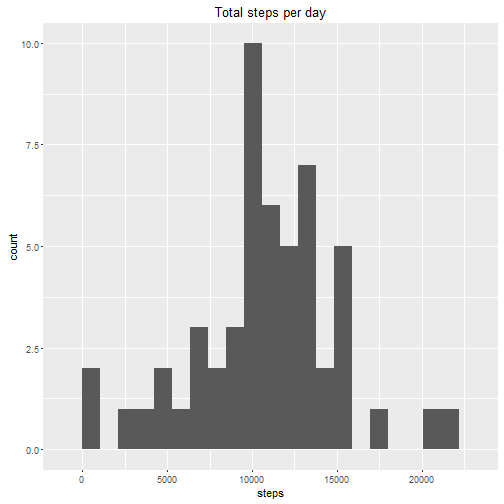
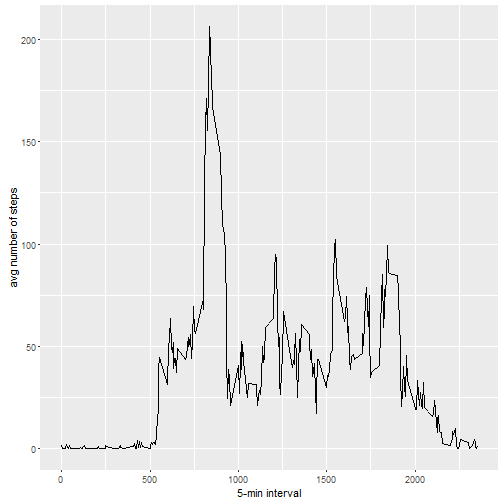
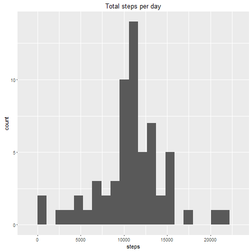
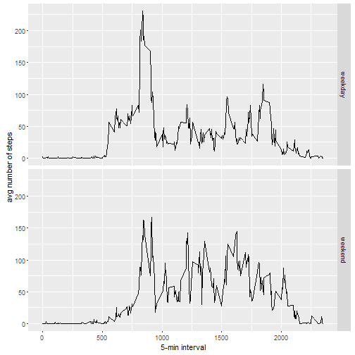

# Reproducible Research Course Project 1

## Loading and preprocessing the data
First of all - loading necessary libs

```r
library(ggplot2)
library(dplyr)
library(lubridate)
```
Then loading data from web and extracting .CSV file

```r
downloadData<-function(url, destfile){    
    if(!file.exists(destfile)){
        ## first try normal method, if no - wget
        tryCatch(download.file(url, destfile=destfile) , error = function(e) e )
        e<-download.file(url, destfile=destfile, method = "wget")
    }
}
extractDownloadedData<-function(srcfile){
    if (file.exists(srcfile)){
        unzip(srcfile)
    }
    else{
        warning("No file to unzip! Use downloadData first");
    }
    
}
DownloadExtractData<-function(){
    url<-"https://d396qusza40orc.cloudfront.net/repdata%2Fdata%2Factivity.zip"
    dstfile<-"repdata-data-activity.zip"
    downloadData(url,dstfile)
    extractDownloadedData(dstfile)
}
DownloadExtractData()
```
Then loading data from file 

```r
activitydata<-(read.csv("activity.csv",na.strings = "NA",stringsAsFactors = FALSE))
```

## What is mean total number of steps taken per day?
Aggregating steps count by date and plotting histogram.

```r
activityavgdates<-aggregate(steps~date,activitydata,sum, na.rm = TRUE)
ggplot(activityavgdates,aes(x=steps)) + geom_histogram(bins=20) + ggtitle("Total steps per day")
```



Then evaluating mean and median. Mean and median evaluates over all days, so days with no data also included and decreasing the result

```r
activitydata.splt <- split(activitydata, as.factor(activitydata$date))

mean(sapply(activitydata.splt, function(x) sum(x$steps, na.rm=T)))
```

```
## [1] 9354.23
```

```r
median(sapply(activitydata.splt, function(x) sum(x$steps, na.rm=T)))
```

```
## [1] 10395
```
So mean equals to ```9354.23``` and median equals to ```10395```


## What is the average daily activity pattern?
Averaging steps over intervals

```r
activityavginterval<-aggregate(steps~interval,activitydata,mean,na.rm=TRUE)
intplot<-ggplot(data=activityavginterval,aes(x=interval,y=steps))
intplot<-intplot+geom_line()+xlab("5-min interval")+ylab ("avg number of steps")
intplot
```



Then finding interval with max average steps

```r
activityavginterval[which.max(activityavginterval$steps),]
```

```
##     interval    steps
## 104      835 206.1698
```


## Imputing missing values

First - evaluating count of missing values:

```r
sum(is.na(activitydata$steps))
```

```
## [1] 2304
```

Our strategy with missing values is to change it to average of steps in same interval from all over days

```r
getavg<-function (step,inter){
    avgsteps = ifelse(is.na(step),filter(activityavginterval,interval==inter)[,2],step)
    avgsteps
    
}

activitywithavg<-mutate(activitydata,steps = mapply(getavg,activitydata$steps,activitydata$interval))
```

Then I plot new histogram and calculate median and mean for new dataset

```r
activityavgdates_afteravg<-aggregate(steps~date,activitywithavg,sum, na.rm = TRUE)
ggplot(activityavgdates_afteravg,aes(x=steps)) + geom_histogram(bins=20) + ggtitle("Total steps per day")
```



```r
activitydatawithavg.splt <- split(activitywithavg, as.factor(activitydata$date))

mean(sapply(activitydatawithavg.splt, function(x) sum(x$steps, na.rm=T)))
```

```
## [1] 10766.19
```

```r
median(sapply(activitydatawithavg.splt, function(x) sum(x$steps, na.rm=T)))
```

```
## [1] 10766.19
```
We can see that our approximation of missing values increase mean from 9354 to 10766 and median from 10395 to 10766. 
Also because in our dataset missing values are in entire day (e.g. we don't have data for entire 2012-10-01), so in new histogram all days with missing values have sum of steps equals to mean.

## Are there differences in activity patterns between weekdays and weekends?
First I determine is day a weekday or weekend 

```r
activitywithavg<-mutate(activitywithavg,weekd_weekend=ifelse((wday(date)==1|wday(date)==7),"weekend","weekday"))
```

Then aggregate average of steps over intervals and new measure,which contains description is day a weekday or weekend and creates plot on it. As we can see activity in weekdays have one massive peak near 8.30AM and in weekend our graph more even.

```r
averagesinterval_wday_wend <- aggregate(steps ~ interval + weekd_weekend, data=activitywithavg, mean)
ggplot(averagesinterval_wday_wend, aes(interval, steps)) + geom_line() + facet_grid(weekd_weekend ~ .) +
    xlab("5-min interval") + ylab("avg number of steps")
```



